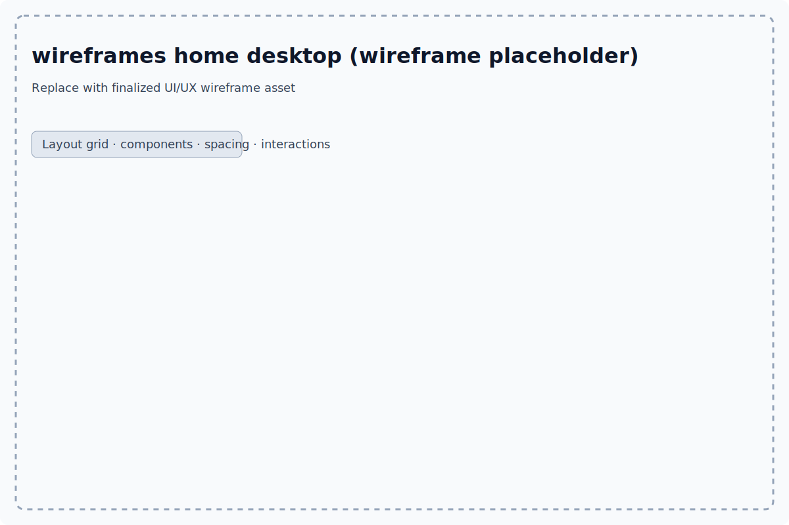
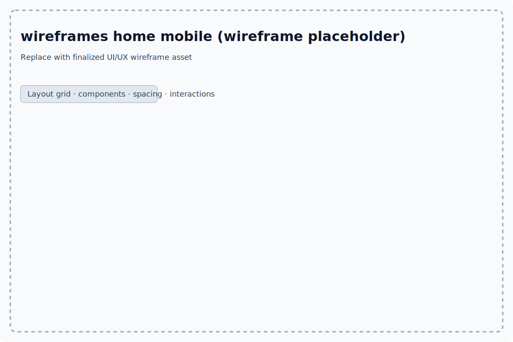
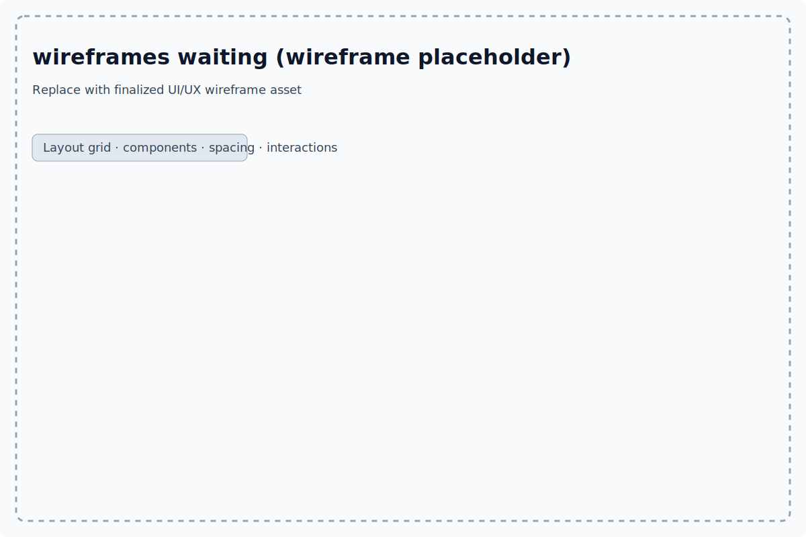
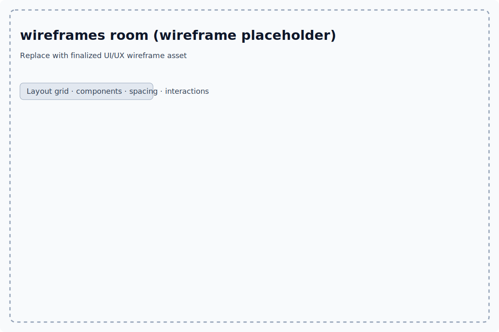
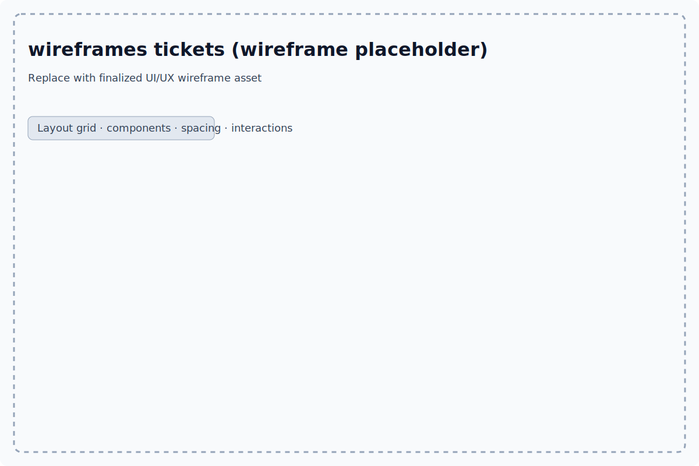
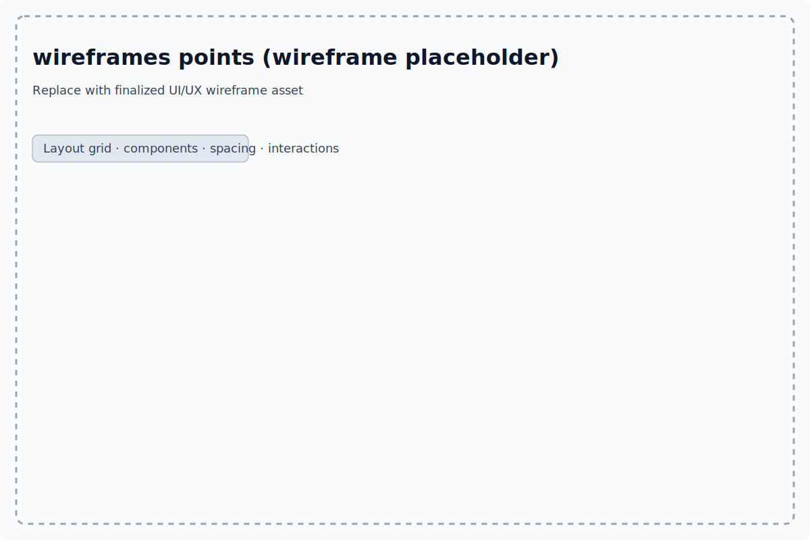

# 线框图（Wireframes）占位资源

以下为当前阶段用于文档与评审的占位线框图（后续可替换为高保真方案）。每张图同时提供 PNG（用于通用预览）与 SVG（矢量、便于审阅与注释）。

> 目录：`docs/ui-ux/`

## 首页（桌面端）
- PNG：
- SVG：

## 首页（移动端）
- PNG：
- SVG：

## 详情页
- PNG：
- SVG：

## 结算 / 购票流程
- PNG：
- SVG：

## 等待室 / 排队状态
- PNG：
- SVG：

## 房间 / 车厢聊天
- PNG：
- SVG：

## 车票 / 订单
- PNG：
- SVG：

## 积分 / 成就
- PNG：
- SVG：

——
说明：以上 PNG 为轻量级占位资源（透明 1×1 像素），SVG 则包含简要标题与占位说明，便于在 PR 与文档中快速预览结构与布局意图。最终落地前可替换为正式输出的设计图。
